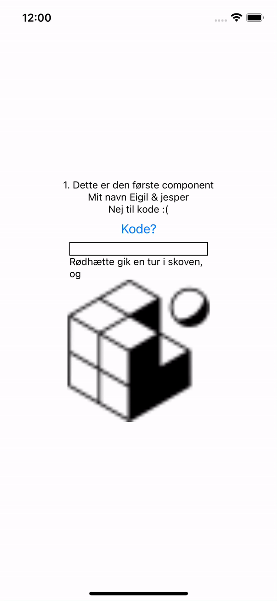

# React Native komponenter 
I denne guide skal vi arbejde med forskellige komponenter i React Native, hvor vi bruger useState, props, samt viser billeder. Du vil få bider af koden og instruktioner til, hvordan du skal færdiggøre komponenterne selv.

# Du kan læse mere om komponenter og views her
- Core-Components her https://reactnative.dev/docs/intro-react-native-components
- og her https://reactnative.dev/docs/components-and-apis
- evt. her https://react.dev/learn/your-first-component
- Læs mere om View her https://reactnative.dev/docs/view

Dit produkt kommer ca. til at se sådan her ud når du er færdig:


## Del 1 - Opret projekt & komponent struktur

1. Start med at åbne en terminal og navigere til den mappe du gerne vil gemme dit projekt i med `cd sti-til-din-mappe-her` i terminalen

2. Opret et nyt React Native projekt:
    ```
    npx create-expo-app --template blank ComponentProject
    ```
    *Husk at navigere ind i projektet med `cd ComponentProject`*

   3. Opret følgende mappe og filer i roden af projektet:
   - Brug `touch` til at oprette filer og `mkdir` til at oprette mappen
   - En mappe kaldet `components`
   - Inde i `components`-mappen skal du oprette følgende filer:
     - `FirstComponent.js`
     - `InputComponent.js`
     - `PropsComponent.js`
     - `ButtonComponent.js`
     - `AssetComponent.js`
    
    <br></br>

    ## Del 2 - FirstComponent.js

   **FirstComponent** skal vise tekst inde i en `View` med en farvet baggrund.

   1. Åbn `FirstComponent.js`, og start med at oprette en function component:
    ```javascript
    import React from 'react';
    import { Text, View } from 'react-native';

    const FirstComponent = () => {
        return (
            // Opret en View, og tilføj en Text-komponent indeni.
        )
    }

    export default FirstComponent;
    ```

    2. **Opgave**:
   - Tilføj en `View` med en rød baggrundsfarve og indsæt en `Text`-komponent, der
     siger "Dette er den første component".
   - Brug inline styles til at tilføje `backgroundColor:` og `marginBottom: 10`.

3. **Import dit component til app.js**:
    - Åbn `App.js`, og importer dit komponent:
    ```javascript
    import { StatusBar } from 'expo-status-bar';
    import { StyleSheet, View } from 'react-native';
    import FirstComponent from './components/FirstComponent';
    ```
    
   ```javascript
        export default function App() {
            return (
                <View style={styles.container}>
                    <View style={{flex: 1, backgroundColor: 'lightblue', alignItems: 'center', justifyContent: 'center', width: '100%'}}>
                        <*Dit-komponent-her*/>
                    </View>

                    <StatusBar style="auto" />
                </View>
            );
        }

        const styles = StyleSheet.create({
            container: {
                flex: 1,
                backgroundColor: '#fff',
                alignItems: 'center',
                justifyContent: 'center',
                paddingTop: 50
            },
        });
    ```
    - Teste din app løbende mens du koder
        Start din app ved at køre:
        ```
        npx expo start
        ```

    - Gør det samme for <b>ALLE de efterfølgende komponenter</b>


<br></br>

## Del 3 - PropsComponent.js

**PropsComponent** skal modtage en prop og vise den i en tekst.
Du kan læse om props her: https://reactnative.dev/docs/props?language=javascript

1. Åbn `PropsComponent.js`, og opret en komponent, der modtager en prop:
    ```javascript
    import React from 'react';
    import { Text, View } from 'react-native';

    const PropsComponent = ({ name }) => {
        return (
            // Opret en View og Text, der viser "Made by {name}"
        )
    }

    export default PropsComponent;
    ```

2. **Opgave**:
   - Brug `props` til at vise en tekst med "Made by {name}".

3. **App.js**:
    - indsæt dit komponent sammen med det første i en ny view + `<PropsComponent name="Dit-navn-her"/>`

<br></br>

## Del 4 - InputComponent.js

**InputComponent** skal bruge `useState` til at gemme en inputværdi og vise en tekst, som ændres baseret på brugerens input.
Du kan læse om useState her: https://www.reactnative.express/react/hooks/usestate

1. Åbn `InputComponent.js`, og start med at importere de nødvendige hooks og komponenter:
    ```javascript
    import React, { useState } from 'react';
    import { Text, TextInput, View } from 'react-native';

    const InputComponent = () => {
        // Opret en state til at gemme inputværdien

        return (
            <View>
                {/* Opret en TextInput-komponent og en Text-komponent */}
            </View>
        )
    }

    export default InputComponent;
    ```

2. **Opgave**:
   - Opret en state kaldet `inputValue` ved hjælp af `useState`.
        - HINT: `const [inputValue, setInputValue] = useState("")`
   - Opret en `TextInput`-komponent, der opdaterer state, når brugeren skriver tekst.
        - HINT: `onChangeText={(txt) => setInputValue(txt)}` + `value={inputValue}`
   - Lav en `Text`-komponent, der viser en dynamisk sætning baseret på det indtastede input.

<br></br>

## Del 5 - ButtonComponent.js

**ButtonComponent** skal have en knap, der ændrer tekst, når den trykkes.

1. Åben `ButtonComponent.js`, og start med at importere `useState` og de nødvendige komponenter:
    ```javascript
    import React, { useState } from 'react';
    import { Button, Text, View } from 'react-native';

    const ButtonComponent = () => {
        // Opret en state til at tracke, om knappen er trykket

        return (
            <View>
                {/* Opret en Text, der viser forskellig tekst afhængigt af state */}
                {/* Opret en Button, der ændrer state når den trykkes */}
            </View>
        );
    }

    export default ButtonComponent;
    ```

2. **Opgave**:
   - Opret en `useState` til at tracke om knappen er trykket.
   - Skift mellem to tekster (f.eks. "Ja til kode!" og "Nej til kode") afhængigt af state.
   - Opret en knap, der ændrer state, når den trykkes.

<br></br>

## Del 6 - AssetComponent.js

**AssetComponent** skal vise et billede, der sendes som en prop.

1. Opret `AssetComponent.js`, og importer `Image` og `View`:
    ```javascript
    import React from 'react';
    import { Image, View } from 'react-native';

    const AssetComponent = ({ url }) => {
        return (
            // Brug Image-komponenten til at vise billedet fra url
        )
    }

    export default AssetComponent;
    ```

2. **Opgave**:
   - Brug `props` til at modtage en `url` til et billede.
   - Vis billedet ved hjælp af `Image`-komponenten, og stil billedet så det har en bredde og højde på 100 pixels.

3. **App.js**:
    - Importere dit komponent som før og og sæt stien til `url={require('./assets/favicon.png')`

<br></br>

## Del 7 - Saml komponenterne i App.js

1. Åbn `App.js`, og importer alle komponenterne, hvis ikke du har gjort det løbende:
    ```javascript
    import { StatusBar } from 'expo-status-bar';
    import { StyleSheet, View } from 'react-native';
    import FirstComponent from './components/FirstComponent';
    import InputComponent from './components/InputComponent';
    import ButtonComponent from './components/ButtonComponent';
    import AssetComponent from './components/AssetComponent';
    import PropsComponent from './components/PropsComponent';
    ```

2. **Opgave**:
   - Placer hver komponent i en `View`-container med forskellige baggrundsfarver og justering.
   - Brug `AssetComponent` til at vise et billede fra din lokale `assets`-mappe (f.eks. `favicon.png`).
   - Brug `PropsComponent` med en prop værdi, f.eks. `"React Native Elev"`.

   Brug dette som guide:
    ```javascript
    export default function App() {
      return (
        <View style={styles.container}>
          <View style={{flex: 1, backgroundColor: 'lightblue', alignItems: 'center', justifyContent: 'center', width: '100%'}}>
            <FirstComponent />
          </View>

          <View style={{flex: 1, backgroundColor: 'lightgray', alignItems: 'center', justifyContent: 'center', width: '100%'}}>
            <InputComponent />
          </View>

          <View style={{flex: 4, backgroundColor: 'blue', alignItems: 'center', justifyContent: 'center', width: '100%'}}>
            <AssetComponent url={require('./assets/favicon.png')} />
          </View>

          <View style={{flex: 1, backgroundColor: 'white', alignItems: 'center', justifyContent: 'center', width: '100%'}}>
            <ButtonComponent />
          </View>

          <View style={{flex: 1, backgroundColor: 'gray', alignItems: 'center', justifyContent: 'center', width: '100%'}}>
            <PropsComponent name="React Native Elev" />
          </View>

          <StatusBar style="auto" />
        </View>
      );
    }

    const styles = StyleSheet.create({
      container: {
        flex: 1,
        backgroundColor: '#fff',
        alignItems: 'center',
        justifyContent: 'center',
        paddingTop: 50
      },
    });
    ```

<br></br>

## Del 8 - Test din app

1. Start din app ved at køre:
    ```
    npx expo start
    ```

2. Tjek, om alle komponenterne vises korrekt, og at knappen fungerer som forventet.

## Ekstra / Udfordring

1. Tilpas stilen for hver komponent, så de passer til appens design.
2. Prøv at ændre billedets størrelse dynamisk afhængigt af skærmstørrelsen.
    
